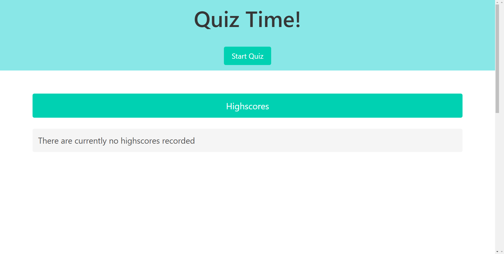
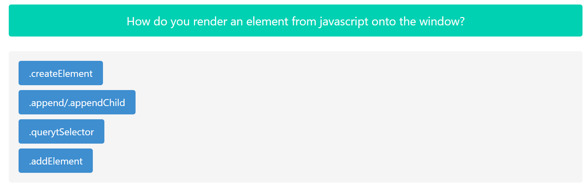
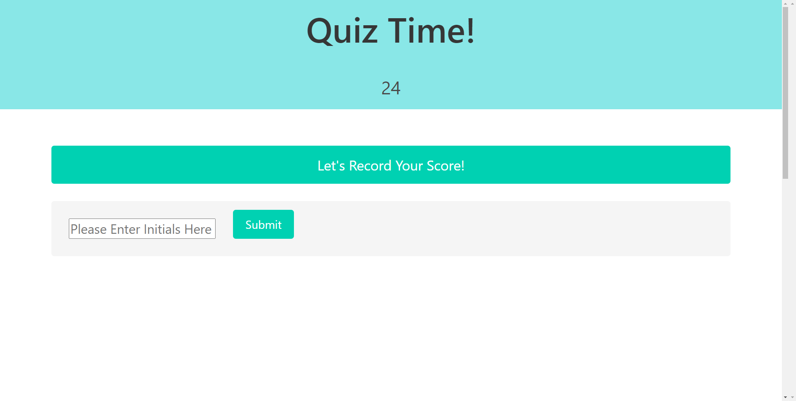

----------------
Title: Javascript Quiz
Description: A small quiz to test the user's knowledge on javascript
Readme Author: Ryan Paragas
Created: 9/16/21
----------------

Javascript Quiz
================

Live Link: [Javascript Quiz](https://paragasr.github.io/Javascript-Quiz/)

This website will test a user's knowledge on Javascript. As they enter the website, it will show previous high scores from other users.  These scores are stored in the local storage. When they click on the start quiz button, it will render a timer and the 1st question will be presented. As they answer a each question, the next question will render. If they answer correctly, the button will highlight green and it will indicate to the user that they got the answer correct. If the answer incorrectly, the button will highlight red as well subract a set ammount of time from the timer. When either the timer reaches zero or when the user answers the last question, the user will be prompted to enter in their initials so that their score can be recorded. Once recorded, the screen will return to Highscore screen as well as show the Start Quiz button.
